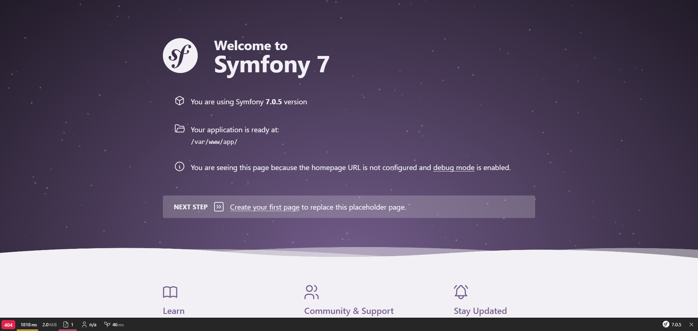

# Symfony project in dev environment on Windows 11 with Docker and WSL

## With Docker

### Prerequisites ✅

- Install [Docker](https://docs.docker.com/desktop/install/windows-install/) on your Windows.
- Launch Docker.

### Installation 🚧

- Clone this project : `git clone https://github.com/Engrev/SymfonyDockerWindows.git`.
- You can change environment variables in [docker-compose.yaml](docker-compose.yaml) as well as the git config in [Dockerfile](docker/Dockerfile).
- Open a terminal at the root of the project and make `docker compose build`.
- Once the build is complete, make `docker compose up -d`. You should see your image and containers appear in Docker Desktop.

If everything works, you can continue.

### Configuration 🔧

You must now create the symfony project.
For this, we need to connect to the php container using the command `docker exec -it <ID_CONTAINER> bash` to run a bash inside the container (**<ID_CONTAINER>** can be recovered thanks to the order `docker ps`).

Once inside, we are in the workspace **/var/www** (as precised in [Dockerfile](docker/Dockerfile)).
It is in this directory that we will install our symfony application, with one of the following commands (**app** can be replaced at your convenience) :
1. `symfony new app --webapp` or `composer create-project symfony/skeleton:"7.0.*" app`.
2. `symfony new app --webapp --version=lts` if you want to use an LTS version of Symfony.
   This shortcut is only available with the Symfony binary.
   If you use composer, you must specify the exact version : `composer create-project symfony/skeleton:"6.4.*" app` for example.

If you use composer, you then need to do `cd app`, `composer require webapp` (you can add the option `--no-interaction` at your commands composer to let him do it, without him asking you any questions).

Now that the symfony project is initialized, you need to configure Apache.
To do this, make `exit` in your terminal to exit the container and return to your windows.
Then run the command `docker cp ./docker/apache.conf <ID_CONTAINER>:/etc/apache2/sites-available/000-default.conf` so that the apache server can find your site and send it to the browser.

### Use 👍

You now have access to your site at [localhost:8000](http://locahost:8000) and to PHPMyAdmin at [localhost:8080](http://locahost:8080) (as precised in [docker-compose.yaml](docker-compose.yaml)).



## With WSL (under Debian)

### Prerequisites ✅

Follow the [installation of outbuildings necessary](docs/WSL.md) for this project.

### Configuration 🔧

You must now create the symfony project.
To do this, go to your user folder.
It is in this directory that we will install our symfony application, with one of the following commands (**app** can be replaced at your convenience) :
1. `symfony new app --webapp` or `composer create-project symfony/skeleton:"7.0.*" app`.
2. `symfony new app --webapp --version=lts` if you want to use an LTS version of Symfony.
   This shortcut is only available with the Symfony binary.
   If you use composer, you must specify the exact version : `composer create-project symfony/skeleton:"6.4.*" app` for example.

If you use composer, you then need to do `cd app`, `composer require webapp` (you can add the option `--no-interaction` at your commands composer to let him do it, without him asking you any questions).

Now that the symfony project is initialized, you must create a symbolic link in the Apache "working folder" : `sudo ln -s /home/<username>/app /var/www/symfony-test.wsl`.
We can now create a [virtual host](docs/WSL_VIRTUALHOST.md).
Above all, don't forget to give Apache access rights to your personal folder :
- by adding the user to the group **www-data** : `sudo adduser <user> www-data`.
- then give the rights to **www-data** on the user folder :
   - `cd /home`.
   - `sudo chgrp -R www-data <user>` (you can change the group only for your application folder but you still have to change the group for the user folder).
     For example :
    ```
    /home
    |-- <user>     <user> <user>
        `-- app    <user> <user>
        `-- xxx    <user> <user>
    ```
  You can make a `sudo chgrp -R www-data /home/<user>/app` and make just one `sudo chgrp www-data /home/<user>`.
  Which give :
    ```
    /home
    |-- <user>     <user> www-data
        `-- app    <user> www-data
        `-- xxx    <user> <user>
    ```
   - `sudo chmod g+rx <user>`.

You can also add the **symfony/apache-pack** dependency to your project by doing a `composer require symfony/apache-pack`.

