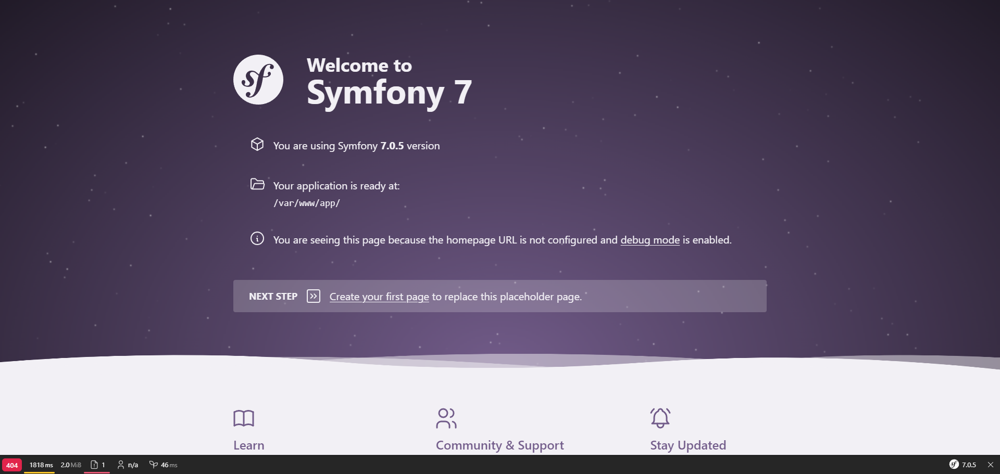

# Projet Symfony en environnement de dev sur Windows 11 avec Docker et WSL

## Avec Docker

### Prérequis ✅

- Installer [Docker](https://docs.docker.com/desktop/install/windows-install/) sur votre Windows.
- Lancer Docker.

### Installation 🚧

- Cloner ce projet : `git clone https://github.com/Engrev/SymfonyDockerWindows.git`.
- Vous pouvez modifier les variables d'environnement dans le [docker-compose.yaml](docker-compose.yaml) ainsi que la config git dans le [Dockerfile](docker/Dockerfile).
- Ouvrez un terminal à la racine du projet et faites un `docker compose build`.
- Une fois le build terminé, faites un `docker compose up -d`. Vous devriez voir apparaitre votre image et les conteneurs dans le Docker Desktop.

Si tout fonctionne, vous pouvez continuer.

### Configuration 🔧

Il faut maintenant créer le projet symfony.
Pour ça, nous avons besoin de nous connecter au conteneur php grâce à la commande `docker exec -it <ID_CONTAINER> bash` pour lancer un bash à l'intérieur du conteneur (**<ID_CONTAINER>** peut être récupérer grâce à la commande `docker ps`).

Une fois à l'intérieur, nous sommes dans l'espace de travail **/var/www** (comme précisé dans le [Dockerfile](docker/Dockerfile)).
C'est dans ce répertoire que nous allons installer notre application symfony, avec l'une des commandes suivantes (**app** est à remplacer à votre convenance) :
1. `symfony new app --webapp` ou `composer create-project symfony/skeleton:"7.0.*" app`.
2. `symfony new app --webapp --version=lts` si vous souhaitez utiliser une version LTS de Symfony.
   Ce raccourci n'est disponible qu'avec le binaire Symfony.
   Si vous utilisez composer, vous devez spécifier la version exacte : `composer create-project symfony/skeleton:"6.4.*" app` par exemple.

Si vous utilisez composer, vous devez ensuite faire un `cd app`, `composer require webapp` (vous pouvez ajouter l'option `--no-interaction` à vos commandes composer pour le laisser faire, sans qu'il vous pose de questions).

Maintenant que le projet symfony est initialisé, il faut configurer apache.
Pour cela, faites un `exit` dans votre terminal pour sortir du conteneur et revenir à votre windows.
Exécutez ensuite la commande `docker cp ./docker/apache.conf <ID_CONTAINER>:/etc/apache2/sites-available/000-default.conf` pour que le serveur apache puisse trouver votre site et l'envoyer au navigateur.

### Utilisation 👍

Vous avez maintenant accès à votre site à l'adresse [localhost:8000](http://locahost:8000) et à PHPMyAdmin à l'adresse [localhost:8080](http://locahost:8080) (comme précisé dans le [docker-compose.yaml](docker-compose.yaml)).

## Avec WSL (sous Debian)

### Prérequis ✅

Suivre les [installations des dépendances nécessaires](docs/fr/WSL_INSTALLATIONS.md) pour ce projet.

### Installation 🚧

- Vous rendre dans le dossier **/var/www**.